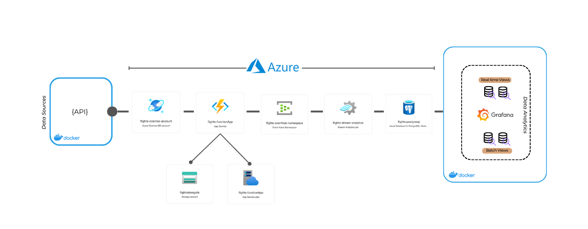
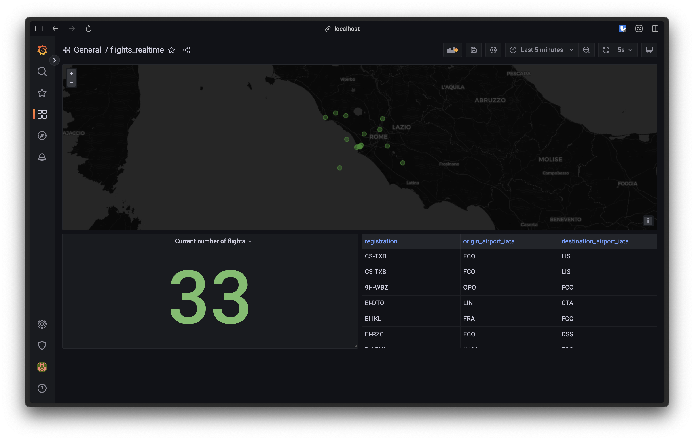

# Flights Monitoring on Azure: Real-time Analytics and Visualization

### Index

* [Introduction](#introduction)
* [Architecture](#architecture)
* [Workflow](#workflow)
* [Scenario details](#scenario-details)
* [Requirements](#requirements)
* [Quickstart](#quickstart)
    * Start the containers
    * Create and setup the Azure resources
    * Start data ingestion
    * Access the dashboard in Grafana
    * Stop the streaming
    * Clean up resources


## Introduction

This project represents an improvement upon work I previously carried out for another exam [[link](https://github.com/lorenzotrcnl/flights-monitoring)]. The evolution involves the utilization of Microsoft's cloud computing platform, Azure. The 'near real-time' nature of the data demands robust architectures, and Azure services are well-suited for this purpose, providing scalability, reliability, and the ability to handle dynamic and fast-paced data streams. The data source is FlightRadar24, a website that offers real-time flight tracking services: through an API, it is possible to obtain information regarding flights worldwide. The developed architecture enables the ability to store and simultaneously analyze data in real time. All of this has been implemented in a Docker environment to allow for future testing and complete replication of the project.



## Architecture

- **Azure Cosmos DB:** A NoSQL document database for flexible and scalable data storage.
- **Azure Functions:** Event-driven serverless computing for efficient data propagation.
- **Azure Event Hub:** Scalable and reliable event ingestion for real-time data streams.
- **Azure Stream Analytics:** Real-time data processing for immediate insights.
- **Azure PostgreSQL DB:** A fully managed relational database for persistent storage.
- **Grafana:** A leading open-source platform for real-time analytics and monitoring.

## Workflow

1. **Data Generation:** Flight data is obtained through an API call in a Python script and then directly inserted into Azure Cosmos DB.

2. **Change Feed:** The change feed will listen for changes to the Azure Cosmos DB container. Each time a new document is added into the collection the change feed will trigger an Azure Function.

3. **Event-Driven Processing:** The trigger function processes the new data and sends it to Azure Event Hubs.

3. **Realtime Data Processing:** Azure Stream Analytics processes the data received from Azure Event Hub. The role of ASA is to gain insights into the flights data, through the use of query.

4. **Query Views:** Processed data is stored in Azure PostgreSQL DB, enabling Grafana to retrieve the latest and updated information.

5. **Data Viz:** Grafana is employed for real-time visualization, offering an interactive and customizable dashboard for users to monitor air traffic analytics.


## Scenario details

This project serves as a comprehensive demonstration of the diverse capabilities offered by Azure services. In practical terms, the implementation focuses on real-time flight analytics centered around Rome Fiumicino Airport. The monitoring is consistently conducted within a specific radius of 50km, providing insightful analyses such as the current number of flights at the airport, a real-time map of flights, and a table displaying the origin and destination airports of each flight in Rome. While these are simple examples, the analytical possibilities can be further expanded with more detailed and specific insights.


## Requirements

* Git
* Docker
* An Azure Subscription


## Quickstart

After **cloning** the repo, place yourself with a terminal in the project folder.

1. **Start the containers**

``` sh
> docker compose up
```

Wait for logs to appears (hopefully without errors) and open a new terminal window.

2. **Create and setup the Azure resources**

The following steps assume that the resources have been properly configured. For more details, refer to [CONFIGURATION.md](CONFIGURATION.md)


3. **Start data ingestion**

Once it's all ready, open a new terminal window and execute the following:
``` sh
> docker exec -it azure-cli bin/bash
> cd home/agents
> source .venv/bin/activate
Eventually > pip install -r requirements.txt
> python datagenerator.py
```

4. **Access the dashboard in Grafana at localhost:3000 | admin@password**



5. **Stop the streaming**

Whenever you want to stop data generation and processing or shutdown the containers, simply hit `ctrl/cmd+c` in each active terminal.

6. **Clean up resources**

Use the following command, in the azure-cli, to delete the resource group and all its contained resources to avoid incurring further costs:
``` sh
> az group delete --name <RESOURCE_GROUP_NAME>
```